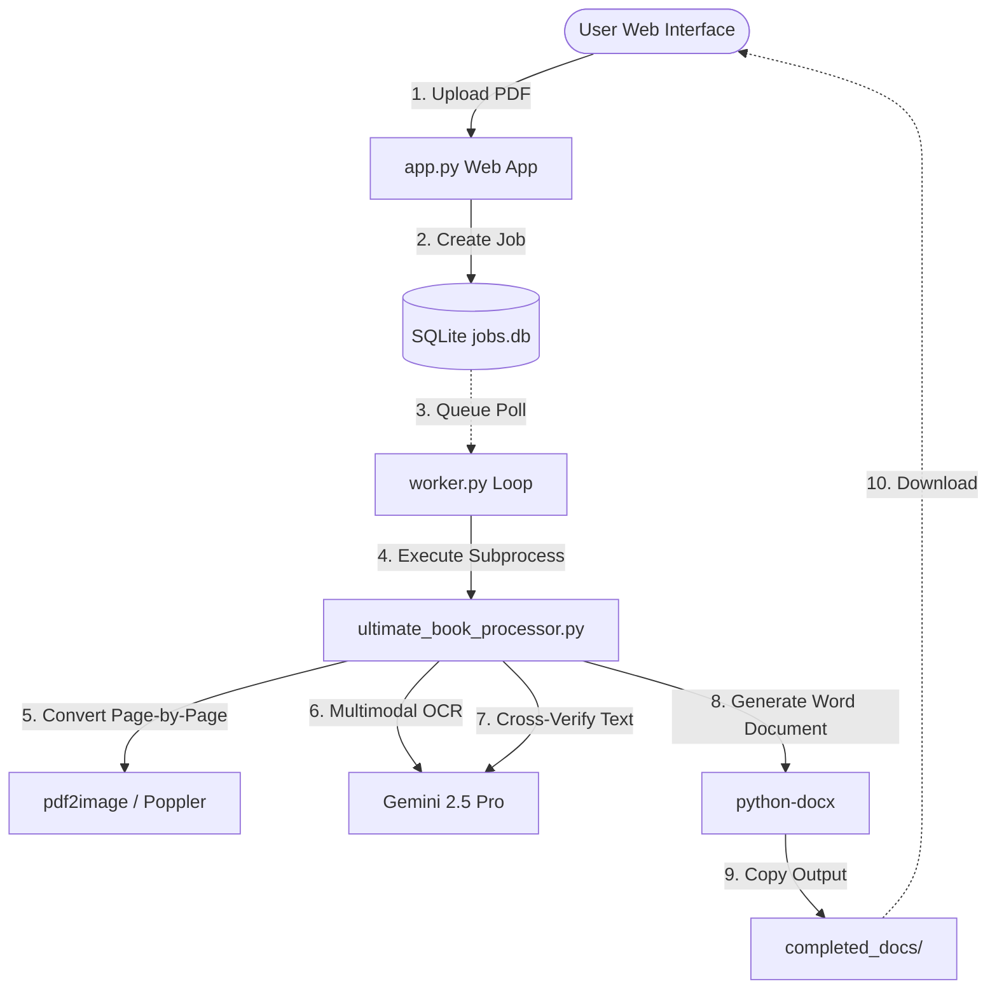

# 🌿 Ayurvedic Book Processor

> **Production-grade transcription, translation, and verification pipeline** designed to convert scanned Ayurvedic textbook PDFs (Sanskrit & Hindi Devanagari script) into formatted Word documents (`.docx`) and AI-illustrated slide decks (`.pptx`/`.pdf`).

Developed for small internal teams of up to 100 users on a private network, using high-accuracy Gemini Multimodal and Imagen AI models.

---

## 📂 Project Structure Map

```text
Ayurvedic_Book_Processor/
├── .dockerignore           # Excludes local files/secrets from Docker build context
├── .env.example            # Configuration template without real secrets
├── .gitignore              # Git ignored files and directories
├── AGENTS.md               # Strict guidelines and architecture rules for AI agents
├── Dockerfile              # Container spec (runs as non-root user, optimized cache)
├── docker-compose.yml      # Orchestrates Web and Worker containers
├── pytest.ini              # Pytest environment configuration
├── requirements.txt        # Production Python dependencies
│
├── app.py                  # Flask Web App (UI, Auth, CSRF, Jobs API, Web server)
├── worker.py               # Background job dispatcher loop
├── utils.py                # Shared helpers (network, validation, environment checks)
│
├── ultimate_book_processor.py # Core PDF pipeline: OCR, Gemini verify, DOCX compilation
├── batch_prompt_planner.py    # Planner helper for batch Gemini prompts
│
├── image_deck_generator.py # Orchestrates slide deck planning & asset compilation
├── image_deck_renderer.py  # Render PIL/Devanagari text layouts and queries Imagen AI
├── image_deck_exporter.py  # Formats slide deck exports to PDFs, ZIPs, and report stats
├── image_deck_prompts.py   # Production-tuned Gemini and Imagen prompt prompts
│
├── production_check.py     # Pre-flight system check for safety & environment validation
│
├── tests/                  # Test suite directory
│   └── test_app_safety.py  # Suite for auth bypass, multi-tenancy, and CSRF tests
│
└── [Runtime Directories] (Auto-generated & Git ignored)
    ├── jobs/               # Contains local status, log streams, and intermediate state files
    ├── completed_docs/     # Final .docx files copied here for download
    ├── logs/               # Global logs directory
    └── slide_deck_outputs/ # Rendered slide decks
```

---

## 🛠 Technology Stack

* **Core Backend:** Python 3.11, Flask, Waitress (WSGI server)
* **AI Engine:** Google Gemini API (paid tier, `gemini-2.5-flash` / `gemini-2.5-pro`), Imagen AI
* **Document Compilation:** `python-docx`
* **PDF Processing:** `pdf2image` (backed by Poppler CLI)
* **Graphics Rendering:** PIL (Pillow) with custom Devanagari font rendering
* **Database & Queue:** SQLite (WAL mode enabled)
* **Authentication:** Per-user authentication with `bcrypt` password hashing
* **Deployment:** Docker, Docker Compose, Windows PowerShell execution wrappers

---

## 🔄 Architecture & Jobs Flow

The system runs asynchronously using a sqlite-based queue to ensure reliability and resumability:



### 1. Job Life Cycle
1. **Upload:** User uploads a PDF. A secure unique job ID is generated.
2. **Database Registration:** The job is added to the SQLite queue database with `status="queued"`.
3. **Dispatcher Selection:** The `worker.py` daemon picks up the job when a slot is free.
4. **Execution:** The worker spawns `ultimate_book_processor.py` to extract page images, invoke Gemini for OCR transcriptions, verify accuracy, and build the target Word document.
5. **Output Delivery:** Completed files are copied to the `completed_docs/` folder, and the database status updates to `completed`.

---

## 🔒 Security Hardening (Current V1 Pass)

The application has been hardened to prevent common vulnerabilities during private network operations:

1. **Authentication:** Per-user password verification backed by `bcrypt`. Dev bypass is disabled unless `ALLOW_AUTH_BYPASS=true` is set.
2. **CSRF Protection:** Secure CSRF tokens are injected into all web forms and validated on all state-modifying requests (`POST`).
3. **Multi-Tenancy Isolation:** Strict database and route checks ensure that normal (non-admin) users can only view, download, modify, or delete their own jobs.
4. **Path Traversal Mitigation:** Manual correction pathways verify that page files stay strictly within the verified bounds of the job directory.
5. **Resource Limits:** Capped concurrent Server-Sent Events (SSE) connections to prevent Waitress thread starvation under load.
6. **Docker Non-Root Execution:** Containers run as `appuser` and exclude local secret files via `.dockerignore`.

---

## 🚀 Getting Started

### Prerequisites
* Python 3.11 installed.
* Poppler installed and added to the PATH (required for PDF-to-image conversion).
* Gemini API Key (paid tier recommended).

### Local Setup
1. Clone the repository and navigate to the directory:
   ```powershell
   cd "C:\Users\sawan\Desktop\new_project\Ayurvedic_Book_Processor"
   ```
2. Create and activate a virtual environment:
   ```powershell
   python -m venv .venv
   .venv\Scripts\Activate.ps1
   ```
3. Install dependencies:
   ```powershell
   pip install -r requirements.txt
   ```
4. Copy configuration template and fill in your keys:
   ```powershell
   copy .env.example .env
   ```

---

## 🎮 Running the Application

### 1. Single Server Mode (Local/Development)
Starts both the Flask Waitress server and the background worker together:
```powershell
.\start_production.ps1
```

### 2. Multi-Process Mode (Recommended for 25+ Concurrent Users)
Run the web application front-end and worker dispatchers as separate processes:
* **Web Server:**
  ```powershell
  .\start_web.ps1
  ```
* **Background Worker:**
  ```powershell
  .\start_worker.ps1
  ```

### 3. Docker Deployment
Deploy via Docker Compose:
```bash
docker-compose up --build
```
*Port mapping defaults to `7860` in Waitress.*

---

## ⚙️ Environment Variables Checklist

Key settings defined in `.env`:

| Key | Default | Description |
|---|---|---|
| `GEMINI_API_KEY` | *(Secret)* | Gemini API credential (paid tier). |
| `ALLOW_AUTH_BYPASS` | `false` | Set to `true` to skip login locally (Dev mode). |
| `TEST_MAX_PAGES` | `0` | Hard cap on pages processed per job (0 = disable cap). |
| `PAGE_WORKERS_PER_JOB`| `2` | Parallel thread workers executing Gemini calls per PDF. |
| `MAX_PARALLEL_JOBS` | `2` | Maximum concurrent jobs dispatched by the worker. |
| `MAX_UPLOAD_MB` | `250` | Maximum allowed size of uploaded PDF file. |

---

## 🧪 Testing

Run automated tests to verify safety boundaries:
```powershell
pytest tests/ -v
```

Tests cover:
* HTTP authentication fail-closed logic.
* CSRF token enforcement on actions (Upload, Delete, Settings).
* User data-boundary limits (preventing access to other users' jobs).

---

## 📑 Operations Documentation
* Check the [PRODUCTION_RUNBOOK.md](file:///c:/Users/sawan/Desktop/new_project/Ayurvedic_Book_Processor/PRODUCTION_RUNBOOK.md) for pre-flight commands, updates, and troubleshooting.
* Verify the security features using [SECURITY_REVIEW_AND_FIXES.md](file:///c:/Users/sawan/Desktop/new_project/Ayurvedic_Book_Processor/SECURITY_REVIEW_AND_FIXES.md).
* Review upcoming features and optimizations in the [POST_DEMO_ROADMAP.md](file:///c:/Users/sawan/Desktop/new_project/Ayurvedic_Book_Processor/POST_DEMO_ROADMAP.md).
* Reference the [EDGE_CASES_CHECKLIST.md](file:///c:/Users/sawan/Desktop/new_project/Ayurvedic_Book_Processor/EDGE_CASES_CHECKLIST.md) to smoke-test edge cases before live demos.
